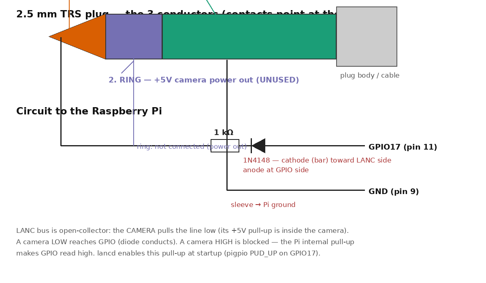

# LancBridge — Raspberry Pi → Sony HXR-MC2500 control over LANC (pbcc project)

The MC2500's USB port is host-only, so PC control goes through the 2.5mm
REMOTE (LANC) jack — driven directly by **GPIO on the Raspberry Pi that
already runs Bitfocus Companion**. No Arduino.

## The LANC (Control-L) protocol

- Open-collector serial bus. The **camera is master**: it starts every frame by
  pulling the line low (start bit), then clocks 8 bytes. A bit is **104 µs**
  (9600-baud timing); start-bit spacing 1200–1400 µs; frame repeat every
  ~20 ms (PAL) / 16.6 ms (NTSC).
- The controller injects its 2 command bytes during words 0–1 of each frame by
  pulling the line low for 0-bits (never driving high).
- A command takes effect after **3–5 consecutive frames**. Keep repeating it
  while the action should continue (e.g. hold zoom), stop to end.
- Verified MC2500-relevant commands (byte0, byte1):

| Function        | Bytes     | Notes                          |
|-----------------|-----------|--------------------------------|
| Rec start/stop  | `18 33`   | one-shot, send 5 frames        |
| Zoom tele slow  | `28 35`   | hold = continuous zoom         |
| Zoom wide slow  | `28 37`   | hold = continuous zoom         |
| Zoom tele fast  | `28 39`   |                                |
| Zoom wide fast  | `28 3B`   |                                |
| Focus near      | `28 47`   | manual focus mode              |
| Focus far       | `28 45`   |                                |
| AF on/off       | `28 41`   | toggle                         |
| Iris open       | `28 55`   |                                |
| Iris close      | `28 54`   |                                |
| Power off       | `18 5E`   |                                |
| Data screen     | `18 B4`   | toggle on LCD                  |

The camera also streams status back in words 2–7 (mode, counter, tape/rec
state) — the daemon reads those frames and exposes recording state.

## Why the Pi's audio jack can't do it

LANC is a bidirectional open-collector serial bus clocked by the camera: the
camera pulses a start bit every frame (~20 ms) and the controller must sync to
that before transmitting. The Pi's 3.5mm jack is analog audio *out only*
(most models have no input at all), so the line can never be heard/synced, and
analog audio can't carry open-collector signaling. It's not a serial port.

## How the Pi does it

- **Transmit**: a pre-built **pigpio waveform** (DMA-timed, exact 104 µs bits,
  immune to Linux jitter) is fired when the camera's start bit is detected.
- **Receive**: after the 2 command bytes are sent, the remaining 6 status words
  are sampled mid-bit using pigpio's hardware-timed `gpioDelay`.
- **Start-bit sync**: a falling-edge callback measures the low pulse; a pulse
  of 1200–1500 µs is a frame start (normal data start bits are only ~104 µs).

## Hardware — parts

- Raspberry Pi (any model with GPIO; the one already running Companion)
- 2.5 mm stereo plug (tip = LANC signal, ring = camera power out, sleeve = GND)
- 1 kΩ resistor (series)
- 1N4148 diode (a 1N4007 also works — see below)



Wiring:

```
LANC plug tip (signal) ──[1kΩ]──►|── GPIO17 (BCM)      diode: anode at GPIO side,
LANC plug sleeve (GND) ───────────────── Pi GND          cathode at LANC side
LANC plug ring ── unused (camera power out; do NOT feed into Pi)
```

The diode makes the Pi behave as true open-collector: GPIO **low** pulls the
LANC line low through diode+resistor; GPIO **high** is blocked by the diode so
the camera's own pull-up raises the line — push-pull waveform output can never
fight the camera's line driver. Common ground (sleeve → Pi GND) is required.
Keep the LANC cable away from mains leads; runs of 10 m+ are fine per the LANC
spec.

Pin: **GPIO17 = physical pin 11** (same pin, two numbering schemes); ground on
physical pin 9 or any GND. Changeable with `--gpio N`.

Diode choice: the 1N4148 (fast switching, low capacitance) is ideal; a 1N4007
works fine at LANC speeds — its few-µs reverse recovery is negligible against
the 104 µs bit time, and current is only a few mA. Orientation matters more
than part choice: anode toward GPIO, cathode (bar) toward the LANC ring.

Pre-flight check: with pigpiod running and the plug in the camera,
`pigs r 17` should read `1` (line idles high, camera pull-up) — proves ground
continuity and diode orientation.

## Daemon — `lanc_gpio.py`

HTTP on `127.0.0.1:8787` (GET for Companion's HTTP Request module):

| Stream Deck button        | Companion HTTP action (GET)                          |
|---------------------------|------------------------------------------------------|
| REC start/stop            | `GET http://127.0.0.1:8787/rec`                      |
| Zoom in (hold)            | `GET .../zoom?dir=in&state=on`  — button DOWN        |
| Zoom in (release)         | `GET .../zoom?dir=in&state=off` — button UP          |
| Zoom out (hold/release)   | `GET .../zoom?dir=out&state=on|off`                  |
| Zoom in fast              | `GET .../zoom?dir=in&speed=fast&state=on`            |
| Focus near / far          | `GET .../focus?dir=near|far&state=on`                |
| Iris open / close         | `GET .../iris?dir=open|close&state=on`               |
| Stop zoom/focus/iris      | `GET .../stop`  — button UP                          |
| AF on/off toggle          | `GET .../aftoggle`                                   |
| Power off                 | `GET .../poweroff`                                   |
| Data screen               | `GET .../display`                                    |
| Status (rec state)        | `GET .../status`                                     |

Same endpoints as the old PC/Arduino `lancd.py`, so Companion wiring is
identical.

Run on the Pi:

```
sudo apt install -y pigpiod python3-pigpio
sudo systemctl enable --now pigpiod
sudo python3 lanc_gpio.py --gpio 17 [--listen 127.0.0.1:8787]
```

## Deployment (systemd)

```
sudo cp lanc_gpio.py /opt/lancbridge/
sudo cp lancd.service /etc/systemd/system/
sudo systemctl daemon-reload
sudo systemctl enable --now lancd
```

`lancd.service` starts after and requires `pigpiod.service`.

Chain: Stream Deck (USB) → Companion (Pi) → lanc_gpio.py → GPIO17 + diode →
2.5mm LANC plug → HXR-MC2500.

## Status

- [x] LANC protocol verified against Sony/Control-L documentation
- [x] pigpio waveform approach (DMA-timed bits, start-bit sync)
- [x] HTTP API tested end-to-end
- [ ] Hardware verification on the church camera
